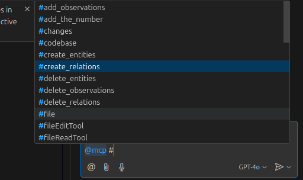

<div align="center">
<h1>Copilot MCP Client for VSCode</h1> 
</div>
<div align="center">

<div align="center">
<h1>Please Read!</h1>
<h2>Since the VSCode team has offically brought MCP support to Copilot, this extension will now defer to their implementation. All existing configurations will be automatically migrated to the official VSCode implementation.</h2>
</div>


[](https://discord.gg/copilotmcp)

</div>
<div style="display: flex; justify-content: center; gap: 20px; margin: 20px 0;">
  
</div>
<div align="center">


[](https://www.gnu.org/licenses/gpl-3.0)
[](https://code.visualstudio.com/api/references/extension-guidelines)
[](https://modelcontextprotocol.io/clients)


</div>

> A powerful VSCode extension that acts as a Model Context Protocol (MCP) client, enabling seamless integration between MCP tool servers and GitHub Copilot Chat. Join the growing ecosystem of interoperable AI applications with flexible integration options.

## 📑 Table of Contents

- [Features](#-features)
- [MCP Feature Support](#-mcp-feature-support)
- [Installation](#-installation)
- [Configuration](#️-configuration)
- [Usage](#-usage)
- [FAQ](#-faq)
- [Requirements](#-requirements)
- [Benefits](#-benefits)
- [Contributing](#-contributing)
- [Author](#️-author)
- [License](#-license)

## ✨ Features

- 🔧 **MCP Server Management**: Connect and manage multiple MCP servers through an intuitive UI
- 🚀 **Copilot Integration**: Expose MCP tools directly to GitHub Copilot Chat participants
- 🎯 **Tool Discovery**: Automatically discover and surface available tools from connected MCP servers
- ⚡ **Server Health Monitoring**: Real-time monitoring of MCP server status and connections
- 🔄 **Automatic Connection Management**: Seamless handling of MCP server connections and reconnections
- 🛠️ **Tool Invocation Support**: Full support for MCP tool invocation through Copilot Chat
- 🔄 **Multiple Server Types**: Support for both process-based and SSE (Server-Sent Events) servers
- 🛡️ **Configuration Migration**: Automatic migration of server configurations to the latest format
- 🧩 **Server Configuration Command**: Manual migration command for updating older configurations

## 🚀 Usage

1. Open the MCP Servers view from the VSCode activity bar
2. Add and configure your MCP servers
3. Enable/disable servers as needed
4. Use GitHub Copilot Chat with your connected MCP tools using the `@mcp` participant
5. View server status and tool availability in real-time

## ❓ FAQ

### Why aren't my servers appearing in the server list?

This is typically caused by connection timeouts between the MCP SDK and your servers. Here's how to fix it:

1. **Use absolute paths for your executables** - Instead of relative paths, specify the full path to your executable:
   ```
   /home/<user>/.nvm/versions/node/v<version>/bin/npx figma-developer-mcp --stdio --figma-api-key=...
   ```

2. **Find your executable paths** - Not sure where your executables are located? Run this in your terminal:
   ```
   which npx    # or node, uvx, etc.
   ```

Using absolute paths helps prevent connection issues and ensures the MCP SDK can reliably launch your servers.

### Why doesn't tool calling work with Claude 3.7?

The tool calling limitations are imposed by the VSCode API and Copilot Chat. Unfortunately, the tool calling models are limited to Claude 3.5 and GPT-4o. If you still face issues with tool calls, try switching to one or the other just for the tool you want to run. You can force a tool call in these models by using the '#' key and selecting the tool manually in your query.

### How can I use the MCP server tools in Copilot Edits?

You can use the tools in Copilot Edits mode by manually specifying the tool(s) with the '#' key, and selecting the tool from the list:

<div align="center">
  
</div>

### Why isn't Copilot calling my tool?

GitHub Copilot has its own internal system prompt that may be dissuading tool calls in the chat. If you find that Copilot isn't using your tools automatically, try using the manual tool selection method mentioned above.

## 🔗 Requirements

- VSCode 
- GitHub Copilot Chat extension
- Compatible MCP servers (see [Example Servers](https://modelcontextprotocol.io/servers))

## 🌟 Benefits

- Enable Copilot to use custom context and tools through MCP
- Join the growing ecosystem of interoperable AI applications
- Support local-first AI workflows
- Flexible integration options for your development workflow

## 👥 Contributing

Contributions, issues and feature requests are welcome!
Feel free to check the [issues page](https://github.com/VikashLoomba/copilot-mcp/issues).

## ✍️ Author

**Vikash Loomba**

* Website: https://automatalabs.io
* Github: [@vikashloomba](https://github.com/vikashloomba)

## 📝 License

Copyright © 2024 [Vikash Loomba](https://automatalabs.io).

This project is licensed under the [GNU General Public License v3.0](LICENSE).

---

_Part of the [MCP Client Ecosystem](https://modelcontextprotocol.io/clients) - Enabling interoperable AI tools for developers_ ⭐️
