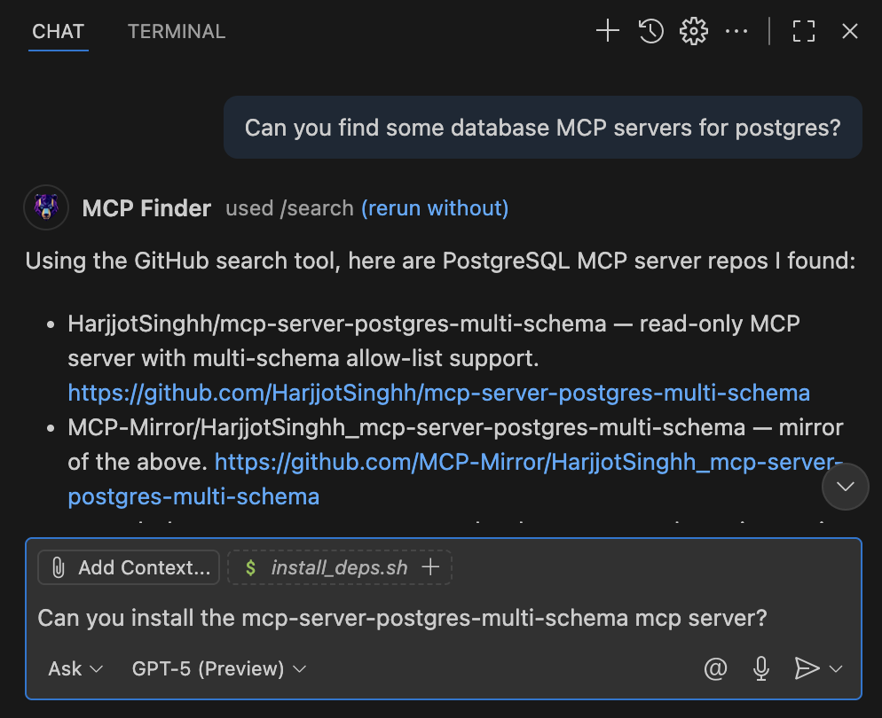
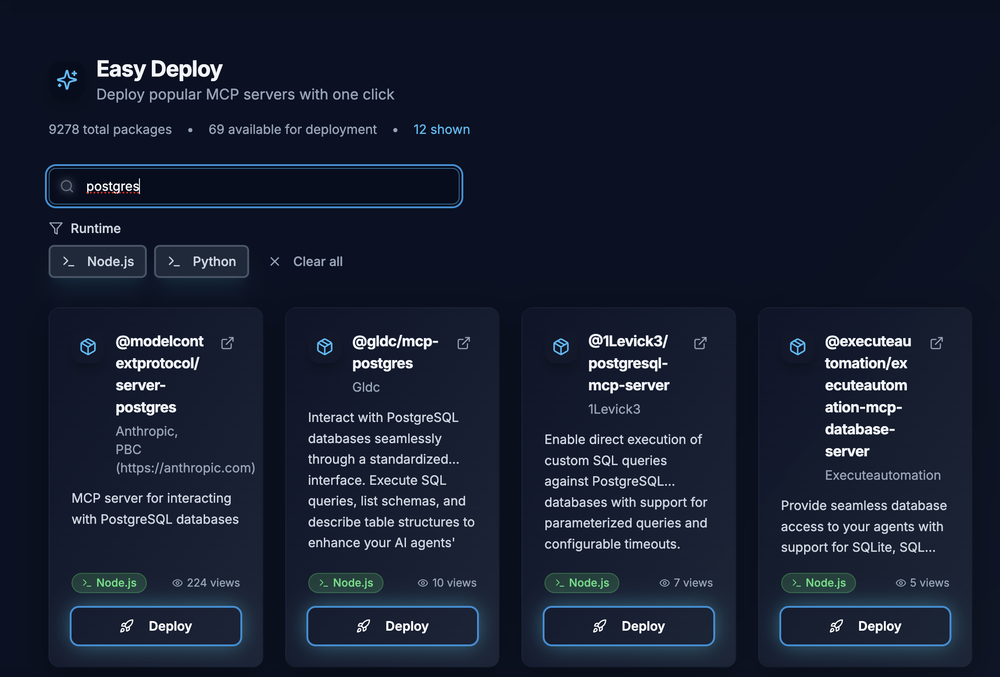
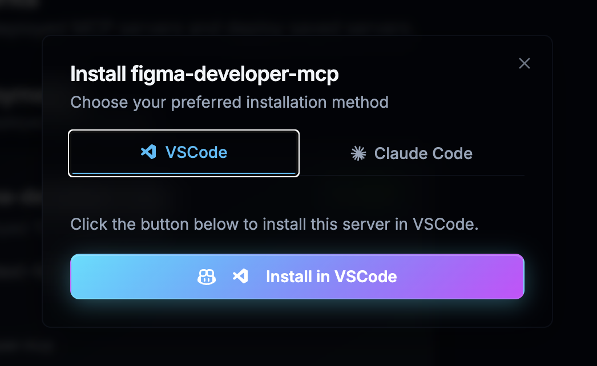
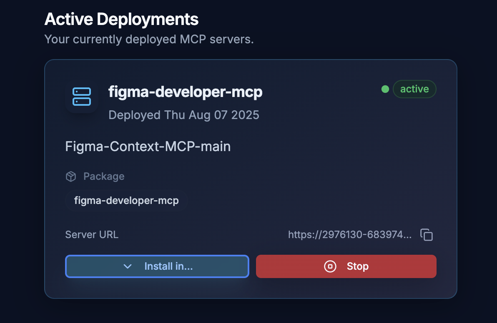

# What's New in Copilot MCP!

*Sponsored by [Cloud MCP](https://cloudmcp.run/?utm_source=copilot-mcp&utm_medium=vscode&utm_campaign=whats-new-0.0.95) - Try out Cloud MCP's [Router Mode](https://cloudmcp.run/blog/cloud-mcp-router?utm_source=copilot-mcp&utm_medium=vscode&utm_campaign=whats-new-0.0.95) that significantly improves tool calling success by AI agents!*

## Version 0.0.95 - AI-Assisted Setup Works Again
*(June 12 2026)*

AI-assisted setup had stopped working: it was pinned to a GitHub Copilot model that was retired on June 1, so every setup attempt failed. This release picks a live model automatically and makes failures explain themselves — and when setup still can't complete, the existing hosted fallback now reports separately so we can see how often it rescues a failed setup.

What's new

- **AI-assisted setup picks a working model automatically.** It was hardwired to a single Copilot model (`gpt-5.2-codex`) that GitHub retired on June 1 2026 — so once that model went away, every AI-assisted setup failed. The extension now queries your Copilot account's live list of available models and uses one that's actually enabled (preferring Claude Sonnet 4.6, then the current GPT-5.3 Codex), with a known-good default if the list can't be reached. Setup works again, and it won't break the next time a single model is retired.
- **Failures explain themselves.** When AI-assisted setup can't finish, the real underlying reason (including the actual error returned by the language model) now reaches the diagnostics instead of a generic "it failed" — so a problem can be understood and fixed instead of guessed at.
- **The hosted fallback now reports separately.** When AI-assisted setup fails, the card's existing **Deploy on CloudMCP** button still takes you to the [hosted catalog](https://cloudmcp.run/?utm_source=copilot-mcp&utm_medium=vscode&utm_campaign=whats-new-0.0.95) for that server — and those failure-driven clicks are now attributed apart from ordinary repo-card deploys, so we can tell how often the fallback rescues a failed setup.
- **The What's New notes show up everywhere.** On VS Code forks that don't ship the built-in Markdown preview, these notes now open as a document (or on the web) instead of silently failing.
- **Telemetry tune-up** for error and auth reporting — still minimal and anonymous; details in the [README Telemetry section](https://github.com/VikashLoomba/copilot-mcp#telemetry).

## Version 0.0.94 - The Installed Tab Sees Everything + Run on CloudMCP
*(June 11 2026)*

This release makes the Installed tab show every MCP server VS Code knows about — including the ones this extension installs — and gives you a hosted option wherever a local install can't help.

What's new

- **The Installed tab now shows servers from VS Code's user-level `mcp.json`** — where VS Code stores user-scope MCP servers since 1.102, including every server you install with this extension's VS Code button. Your own installs finally show up. These entries are read-only for now: if you try to edit or delete one, the extension points you to the **MCP: Open User Configuration** command.
- **Run on CloudMCP, right from Official Registry cards.** Every registry card now has a [Run on CloudMCP](https://cloudmcp.run/?utm_source=copilot-mcp&utm_medium=vscode&utm_campaign=whats-new-0.0.94) button alongside VS Code, Claude Code, and Codex — and when a server can't be installed locally, or your registry search comes up empty, a one-click link takes you to the hosted catalog with the server or search prefilled.
- **Remote servers now install into VS Code in VS Code's native config shape** (explicit `http`/`sse` type and a plain header map), so "Add Remote to VS Code" from registry cards produces entries VS Code actually accepts.
- **Clearer failures.** A registry search that hits an API error now says "Search failed — try again" instead of pretending there were no results, and when AI-assisted setup fails the card now tells you what happened and offers the hosted fallback — while the logs capture the real underlying error instead of a generic message.
- **Leaner, more reliable releases:** git hooks are no longer bundled into the extension package, the dependency lockfiles were refreshed (orphaned packages pruned and in-range dependency updates picked up — including runtime dependencies like axios and undici), and CI/release workflows were updated.
- **Telemetry tune-up** for install and error reporting — still minimal and anonymous; details in the [README Telemetry section](https://github.com/VikashLoomba/copilot-mcp#telemetry).

## Version 0.0.93 - Telemetry Overhaul + Smarter CloudMCP Deploys
*(June 11 2026)*

This release replaces the old telemetry pipeline and makes "Deploy on CloudMCP" land you exactly where you need to be.

What's new

- **Telemetry overhauled.** The old, broken telemetry pipeline has been removed entirely. The new telemetry is minimal and anonymous — basic usage events like search/install/link clicks, including the search terms you type (truncated), with no file contents and no account identifiers — and it fully respects VS Code's telemetry settings. Details in the [README Telemetry section](https://github.com/VikashLoomba/copilot-mcp#telemetry).
- **"Deploy on CloudMCP" now takes you to a search prefilled for the server you clicked**, instead of a generic landing page.
- **Reliability and CI fixes**, including more resilient release packaging.

## Version 0.0.91 - Installed Skills Management + CI Test Automation
*(February 16 2026)*

This release rounds out the new skills workflow with installed-skill management.

What's new

- Added an **Installed Skills** view in the Skills tab when search is empty.
- Added uninstall support for installed skills with:
  - confirmation dialog
  - agent selection (preselected to all installed agents)
  - shared-path safety guardrails that require uninstalling from all listed agents when needed
- Improved installed skill card layout so location details and uninstall actions are easier to scan.

## Version 0.0.90 - Skills Search + Multi-Agent Install Controls
*(February 11 2026)*

This release adds first-class skills discovery and installation directly in the sidebar.

What's new

- Added a dedicated **Skills search mode** in the Search tab, separate from MCP server search.
- Added `skills.sh`-powered search with paginated results and inline sub-skill discovery.
- Added sub-skill selection controls with **all sub-skills selected by default**.
- Added install targeting controls for agents and scope (project/global), including:
  - install to all detected agents
  - select specific detected agents
  - hidden, scrollable advanced options behind a gear button
- Search is now the first/default top-level tab in the panel.

## Version 0.0.88 - Codex CLI MCP Installer
*(October 17 2025)*
We are excited to introduce **Codex CLI MCP Installer** support in Copilot MCP! This new feature allows users to seamlessly install MCP servers directly into **Codex CLI** from Copilot MCP.

## Version 0.0.86 + 0.0.87 – Clipboard-Friendly Claude Installs ✂️

- Claude Code installer wil now copy the generated command to your clipboard in case the install fails.

## Version 0.0.85 – Claude Code, Bug Fixes, and Reliability Improvements 🛠

- Unified install controls let you choose between VS Code and Claude Code before running a single install button.
- Claude Code support: Install MCP servers directly into Claude Code (if installed) using stdio or HTTP transports.

## Version 0.0.84 – Remote Registry Installs Are Back 🎯
*(October 8 2025)*

We’ve restored full compatibility with the Official MCP Registry and just added the capability to **add remote HTTP MCP servers** right from Copilot MCP!

What’s new

- Remote endpoints now install cleanly with automatic `${input:...}` prompts for tokens and headers.
- Registry searches are working again, so results appear immediately with updated metadata.
- Remote MCP server results will show an "Install Remote" button that will set up VSCode with the server.

## Version 0.0.80 – Official MCP Registry Search + Direct Installs 🎉
*(September 12 2025)*

Discover and install MCP servers faster and more reliably — now with first‑class support for the Official MCP Registry.

What’s new

- Official MCP Registry provider: Search the public, curated MCP registry right inside the extension. The registry is now the default provider, with the option to switch back to GitHub anytime.
- Direct installs from the registry: Install local packages (npm, PyPI, etc.) or remote endpoints with one click — no copy/paste or manual config. We use the registry’s metadata to set up the right command and arguments automatically.
- Smart, secure prompts: When a server needs API keys or other values, you’ll be prompted at install time. Secrets are captured securely, and missing values are requested so you’re never left guessing.
- Remote server support: Add remote MCP servers by URL from the registry, including headers for authentication when needed.
- Reliability improvements: Ensures the correct package spec is included for installs (so commands like npx/uvx “just work”), fixes for remote‑only servers, and other polish.

We hope this makes discovering and using MCP servers simpler, faster, and more dependable in VSCode. Let us know what you’d like to see next!

*Sponsored by [Cloud MCP](https://cloudmcp.run/?utm_source=copilot-mcp&utm_medium=vscode&utm_campaign=whats-new-0.0.80) – Deploy Remote MCP servers in seconds*

## Version 0.0.70 – GPT-5-mini Powered Installation & Enhanced Reliability! 🚀
*(August 19 2025)*

**Intelligent MCP Server Installation with Advanced AI Assistance!**

We've supercharged Copilot MCP with GPT-5-mini to make installing MCP servers smarter, faster, and more reliable than ever before! 

This release brings major performance improvements and an improved installation process. 

Use Copilot MCP in VSCode Copilot Chat to ask for help finding and installing MCP servers, and let Copilot guide you through the process with ease!

**What's New**

* **🤖 GPT-5-mini AI Assistant** – Advanced AI now guides you through MCP server installations, providing intelligent and reliable setup for servers
* **⚡ Enhanced NPX/UVX/Docker MCP Server Support** – Dramatically improved reliability for installing MCP servers using NPX, UVX, and Docker
* **🔍 Smart Installation Detection** – Automatically detects the best installation method for each MCP server
* **🚀 Performance Boost** – Significant improvements in search speed, installation time, and overall extension responsiveness
* **🔧 Intelligent Error Recovery** – AI-powered error detection and resolution suggestions during installation

**Coming Soon**
* **🌐 CloudMCP.run Integration** – Seamless one-click deployment of MCP servers to CloudMCP.run and installation in VSCode.
 

**CloudMCP.run Updates**

* **🌐 CloudMCP.run Search** – CloudMCP now features enhanced search, integrating with mcp-get to help you find and deploy remote MCP Servers secured by OAuth 2.1!

Tired of dealing with local installations? Try [CloudMCP.run](https://www.cloudmcp.run?ref=copilot-mcp) for zero-setup, cloud-hosted MCP servers! Get started with your first month free!

**Thanks for being a user**

of Copilot MCP! We hope you enjoy these powerful new features that make it easier than ever to discover, install, and use MCP servers in your development workflow.

---

## Version 0.0.68 – One-Click VSCode Installation from CloudMCP.run!
*(August 2025)*

**Deploy Any MCP Server to VSCode with a Single Click!**

We've just made it incredibly easy to go from discovering an MCP server to using it in VSCode. CloudMCP.run now offers **seamless one-click installation** directly into your VSCode environment – no terminal, no manual configuration, just instant productivity!

**What's New**

* **🚀 One-Click VSCode Installation** – Deploy any MCP server from NPM, PyPI, or GitHub, then install it directly in VSCode with a single button click
* **🎁 Free for Copilot MCP Users** – Get 2 free deployments, no credit card required – just sign in with GitHub and start deploying!
* **📦 Universal Package Support** – Custom deployment feature supports any MCP server, not just those in our registry
* **⚡ Instant Setup** – From deployment to VSCode integration in under 30 seconds
* **🔐 Secure & Isolated** – Each deployment runs in its own secure environment with enterprise-grade protection

**How It Works**

1. Deploy any MCP server on CloudMCP.run (from our registry or custom packages)
2. Click the "Install in VSCode" button on your active deployment
3. Choose VSCode as your installation method
4. Click "Install in VSCode" – that's it!

**Why This Changes Everything**

No more wrestling with:
- Terminal commands and package managers
- Environment variables and API keys
- Local process management
- Configuration file editing

Just deploy on CloudMCP.run and instantly use your MCP servers in VSCode with GitHub Copilot!

**Try It Today – 2 Free Deployments!**

Experience the magic of one-click MCP server installation. Visit [CloudMCP.run](https://www.cloudmcp.run?ref=copilot-mcp) to explore our growing catalog of MCP servers or deploy your own custom servers from any package registry.

* **Learn more**: Read our [detailed guide on deploying any MCP server](https://www.cloudmcp.run/blog/deploy-any-mcp-server?ref=copilot-mcp)
* **View pricing**: Check out our [flexible pricing options](https://www.cloudmcp.run/pricing?ref=copilot-mcp) after your free deployments

---

## Version 0.0.67 – CloudMCP.run Special Pricing!

Limited time offer for Copilot MCP users! Get **100% off** your first month on CloudMCP.run when you sign up!

## Version 0.0.66 – CloudMCP.run Official Launch! 🚀
*(July 2025)*

**Give Your AI Real Superpowers – No Technical Setup Required!**

We're thrilled to announce the official launch of **CloudMCP.run** – a revolutionary platform that transforms Copilot, Claude, and any MCP-enabled AI from basic agents into powerful assistants that can actually *do things*!

**What's New**

* **🌟 Deploy with CloudMCP Button** – Every MCP server in search results now features a "Deploy on CloudMCP" button that takes you directly to CloudMCP.run
* **⚡ 30-Second Server Setup** – CloudMCP handles OAuth sign-in automatically – no API keys, terminal, or local process needed!
* **🔐 Enterprise-Grade Security** – Industry-standard OAuth 2.1 ensures your data stays secure with granular access control
* **💰 Flexible Pricing** – Affordable for anyone!
* **📱 Works Everywhere** – VSCode, Mobile apps, web clients, desktop tools – if it supports MCP, it works with CloudMCP!

**Why CloudMCP Changes Everything**

Finally, a remote MCP hosting solution that makes it easy for anyone to connect their AI to the tools and data they need. With CloudMCP.run, you can:
- Connect to any API or service seamlessly
- Schedule meetings directly in your calendar
- Search and analyze your data in real-time  
- Manage files and documents instantly

**Coming Soon**: Tighter integration between VSCode and CloudMCP.run for one-click deployment directly from the extension!

Visit [CloudMCP.run](https://www.cloudmcp.run) to start your trial and give your AI real superpowers today!

---

## Version 0.0.54 – CloudMCP.run Integration & Improved Installation Experience
*(July 2025)*

Get ready for cloud-hosted MCP servers and enjoy a clearer installation experience!

**What's New**

* **CloudMCP.run Preview** – New "Deploy on CloudMCP.run" button on all search results lets you express interest in our upcoming cloud hosting service for MCP servers
* **Clearer Installation Options** – Install buttons now appear on all search results, with auto-disabled state for servers that require manual setup
* **Enhanced UI Feedback** – Better visual indicators show which servers support one-click installation vs. manual configuration

---

## Version 0.0.53 – Framework Update & Enhanced AI Integration
*(July 2025)*

We've upgraded our AI framework to deliver better performance and reliability!

**What's Changed**

* **Updated AI Framework** – Upgraded to @ax-llm/ax v12 with improved API compatibility and performance enhancements
* **Better Multi-Agent Support** – Refactored our agent architecture for more reliable MCP server discovery and installation
* **Improved Type Safety** – Enhanced TypeScript types throughout the codebase for better development experience
* **Code Cleanup** – Removed deprecated code and unused dependencies for a leaner, faster extension

---

## Version 0.0.50 – Smarter Discovery & Better Management  
*(June 2025)*

Our latest release focuses on making MCP servers even easier to find, install and manage.

**Highlights**

* **Improved Search Pagination** – Repository search now uses a *next-page cursor* behind the scenes, giving you faster, more accurate results when browsing for MCP servers.
* **Richer Search Intelligence** – A new AI-powered query generator & result filter help surface only *installable* MCP servers (no more clone-and-build surprises!).
* **Enhanced Management Experience** – The extension can now distinguish between *workspace*-specific and *user*-level MCP server configurations, so you have fine-grained control over where servers are installed.
* **Debug-Friendly Mode** – Enable in-depth logs for troubleshooting with a single setting.
* **Update Notifications** – A new in-product notice shows this What's New page automatically after you install or upgrade, so you never miss out on fresh features.
* Plus numerous performance improvements and bug fixes.

Stay Tuned for more exciting updates! 🚀 (On-demand Cloud MCP's, anyone 👀?)

---

## Version 0.0.40 - A Whole New Focus!

We're thrilled to announce a major evolution for **Copilot MCP**!

Previously, this extension assisted with the manual setup of server tools for GitHub Copilot. Many of these tools extend Copilot's abilities by leveraging the **Model Context Protocol (MCP)**. With recent advancements in Visual Studio Code, which now natively supports the integration of tools via MCP, we saw an opportunity to provide even more value to your Copilot experience.

**Introducing Your New MCP Server Discovery Hub!**

**Copilot MCP** has been completely reimagined and refactored. It's now your go-to tool for **finding and installing Model Context Protocol (MCP) servers**. These MCP servers empower GitHub Copilot by connecting it to a vast array of external tools and data sources, significantly expanding its capabilities.

Here's what's new:

*   **Discover MCP Servers on GitHub**: Seamlessly search and browse a growing catalog of open-source MCP servers. Find tools built by the community that enable Copilot to perform new actions and access diverse information.
*   **One-Click Installation**: Gone are the days of manual setup! Leveraging VS Code's native ability to integrate with MCP-compliant server tools, you can now install and configure them with a single click.
*   **Streamlined Workflow**: Get from discovery to using new Copilot tools faster than ever before. We handle the complexities so you can focus on enhancing your AI-assisted development.

We believe this new direction will make it significantly easier for you to unlock the full potential of GitHub Copilot by connecting it to a diverse range of powerful tools and data sources.

We're excited for you to try out the new **Copilot MCP** and welcome your feedback!
